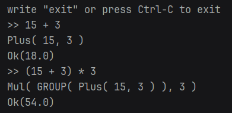

# TinyCalc

Simple interpreter I wrote to learn FSMs(DFAs, NFAs), tokenization and basics of ASTs.

:warning:
here you will see some really-really bad code since I just wanted to learn key terms of interpreters and didn't want to struggle too much.

```bash
git clone https://github.com/ppaprikaa/tinycalc.git
cd tinycalc
cargo build 
./target/debug/tinycalc
```

## Operators
+, -, *, /

### Precedense
*, / over +, -

## Grouping
with `( )`

## Example

